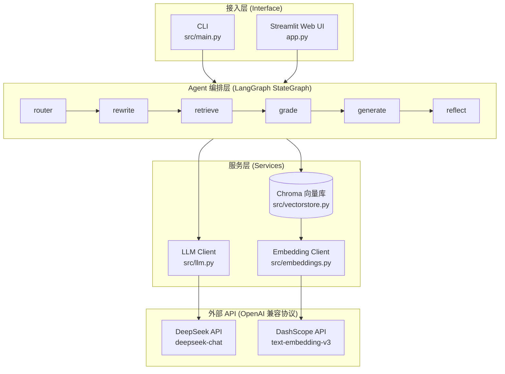
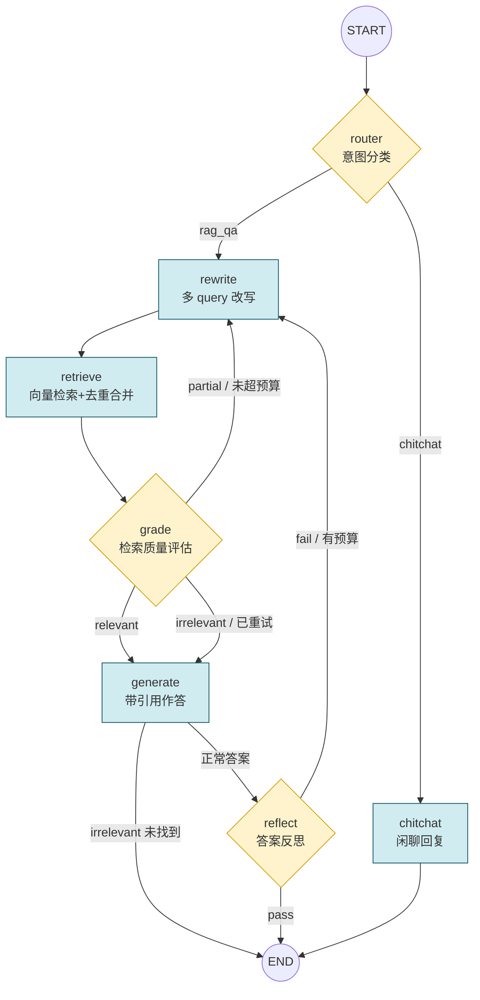
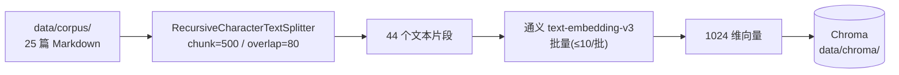
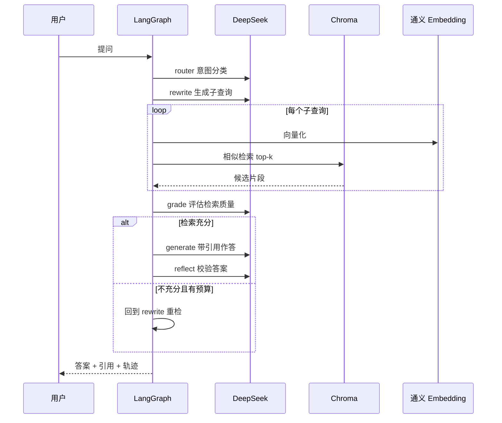
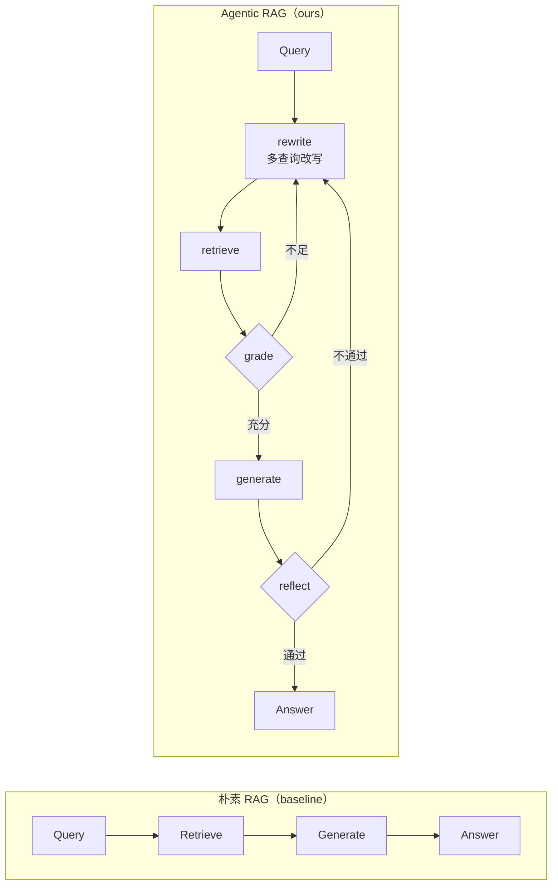

# 系统架构图

> 对应报告第三章「系统架构与设计」。所有图使用 Mermaid 绘制，GitHub 可直接渲染；
> 导出 PNG 可用 VS Code「Markdown Preview Enhanced」右键导出，或 mermaid.live 在线导出。

---

## 1. 总体分层架构

**设计要点**：四层解耦。接入层（CLI / Web）只负责输入输出；Agent 编排层是核心，用 LangGraph 状态机驱动多步推理；服务层封装 LLM、Embedding、向量库；外部 API 全部走 OpenAI 兼容协议，更换厂商只需改 `.env`。

---

## 2. LangGraph 状态机（核心）

**循环控制**：`rewrite_count` 作为统一重试预算（`MAX_REFLECT_ROUNDS=2`，即最多重写 3 次）；
`irrelevant` 早退避免在知识库外问题上空转；LangGraph `recursion_limit=15` 作为硬兜底。

---

## 3. 数据流

### 3.1 离线入库（ingest，一次性）

### 3.2 在线问答（query）

---

## 4. 朴素 RAG vs Agentic RAG（对照实验示意）

**对比结论**：朴素 RAG 是一条直线（一次检索定胜负）；Agentic RAG 引入「改写—评估—反思」反馈环，
在需要定位深层条款的复杂问题上显著更稳健（详见 [evaluation.md](evaluation.md) §4）。
